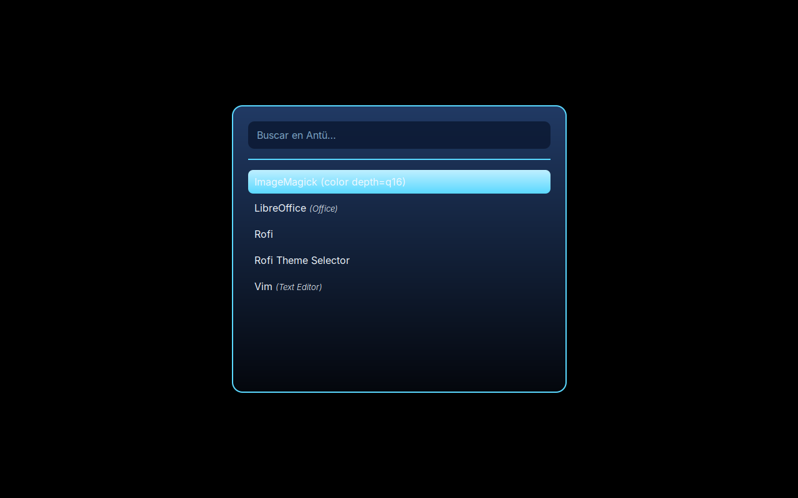

# Arquitectura de Antü OS

## Idea general

Antü OS **no** es un kernel ni un sistema operativo escrito desde cero.
Es una **distribución Linux personalizada** (un "respin" de Debian/Ubuntu)
que:

1. Usa el **kernel Linux** y la base de Debian/Ubuntu tal cual, para heredar
   soporte de hardware, drivers, seguridad y actualizaciones.
2. Reemplaza la capa de **escritorio y experiencia de usuario** por un
   diseño propio: familiar y fácil de usar para cualquiera que venga de
   Windows o mac, pero sin copiar a ninguno de los dos (ver sección
   "Shell de escritorio" más abajo).
3. Se empaqueta como **imagen ISO booteable e instalable** usando
   [`live-build`](https://manpages.debian.org/testing/live-build/lb.1.en.html),
   la herramienta oficial de Debian para construir distribuciones live/
   instalables.

Este enfoque es el que usan distribuciones reales y exitosas con el mismo
objetivo (dar a Linux una cara familiar para usuarios de Windows), como
Zorin OS o Linuxfx/Windowsfx. Nos permite tener algo **robusto y usable en
semanas**, en vez de años, sin sacrificar la posibilidad de personalizar
todo el sistema.

## Por qué no un kernel/OS desde cero

Escribir un sistema operativo completo desde cero (kernel, drivers,
scheduler, stack de red, sistema de archivos, entorno gráfico) es un
proyecto de investigación de varios años-persona, y aun así no llegaría a
tener la compatibilidad de hardware ni la robustez de Linux, que ya tiene
más de 30 años de desarrollo. Por eso la estrategia de este proyecto es
**construir sobre Linux**, no competir con él.

## Componentes por capa

| Capa | Tecnología | Notas |
|---|---|---|
| Kernel | Linux (kernel de Debian/Ubuntu) | Sin modificaciones en Legacy/Standard. En Pro se puede usar un kernel más nuevo (`linux-image-*-generic` o `liquorix`) para mejor soporte de hardware reciente. |
| Init / servicios | systemd | Estándar de Debian/Ubuntu. |
| Gestor de paquetes | APT / dpkg | Mismo ecosistema que Debian/Ubuntu, sin cambios. |
| Entorno gráfico base | X11 (Wayland opcional en Pro) | Depende de la edición. |
| Escritorio | XFCE (Legacy) / Cinnamon (Standard) / KDE Plasma (Pro) | Elegidos por consumo de recursos vs. features. |
| Shell / identidad | Barra superior única propia de Antü, wallpaper, logo | Configurada por edición en `editions/*/config/includes.chroot/`, assets en `shared/branding/`. Ver sección "Shell de escritorio". |
| Build system | `live-build` | Config declarativa en `editions/*/config/`. |

## Las tres ediciones

### Antü Legacy (`editions/antu-legacy`)

- Público: PCs con hardware equivalente a la era de Windows XP (Pentium 4 /
  Core 2 Duo, 512MB–2GB RAM, sin aceleración 3D confiable).
- Escritorio: **XFCE**, con compositor desactivado por defecto. Shell:
  barra superior única (ver "Shell de escritorio"), sin dock ni animaciones.
- Arquitectura: `i386` (32 bits). `live-build` solo permite una arquitectura
  por configuración, y `i386` corre tanto en hardware de 32 como de 64 bits,
  a diferencia de `amd64` (que no arranca en máquinas puramente de 32 bits) —
  por eso es la opción que da máxima compatibilidad con hardware viejo.
- Prioridad: arrancar rápido y consumir poca RAM, no efectos visuales.

### Antü Standard (`editions/antu-standard`)

- Público: uso doméstico/oficina, hardware equivalente a Windows 7 en
  adelante (Core i3+, 4GB+ RAM).
- Escritorio: **Cinnamon**. Shell: barra superior única (ver "Shell de
  escritorio"); el dock separado y más applets quedan para una siguiente
  etapa (ver `docs/ROADMAP.md`).
- Arquitectura: `amd64`.
- Prioridad: balance entre estética moderna y bajo consumo de recursos.

### Antü Pro (`editions/antu-pro`)

- Público: hardware potente (multinúcleo, GPU dedicada, SSD, 16GB+ RAM).
- Escritorio: **KDE Plasma**, con todos los efectos de composición
  habilitados, soporte Wayland, y ajustes de kernel/scheduler orientados a
  aprovechar múltiples núcleos y GPU.
- Arquitectura: `amd64` (con perfiles opcionales para `arm64` a futuro).
- Prioridad: máximo aprovechamiento del hardware disponible, sin resignar
  robustez.

## Shell de escritorio

Antü no copia ni a Windows ni a mac: toma la idea de una **barra global
única** (como mac, en vez de la barra de tareas de Windows) porque es un
patrón de interacción probado y fácil de aprender, pero la usa a su manera
y con la identidad visual propia (el arco de luz del logo, la paleta azul
profunda).

**Base común a las 3 ediciones** (implementada):

- Una barra fija arriba de la pantalla, con:
  - Lanzador de aplicaciones a la izquierda, con el logo de Antü.
  - Bandeja del sistema y reloj a la derecha.
- Un **dock** fijo abajo (Standard y Pro; Legacy no lo tiene, ver más
  abajo) con las apps fijadas y abiertas — ahí vive el cambio de ventana,
  no en la barra de arriba.
- Wallpaper de Antü como fondo por defecto.

En **Legacy** no hay dock separado (para no gastar recursos en un panel
extra): la lista de ventanas abiertas queda directamente en la barra de
arriba, como única barra.

Esto está configurado de fábrica en cada edición usando el mecanismo nativo
de cada entorno de escritorio (no es un tema visual superficial, son los
archivos de configuración reales que lee cada DE al iniciar sesión):

| Edición | Mecanismo | Archivos |
|---|---|---|
| Legacy (XFCE) | `xfconf` vía `/etc/skel` | `editions/antu-legacy/config/includes.chroot/etc/skel/.config/xfce4/xfconf/xfce-perchannel-xml/` |
| Standard (Cinnamon) | Defaults de `dconf` | `editions/antu-standard/config/includes.chroot/etc/dconf/db/local.d/00-antu-desktop` |
| Pro (KDE Plasma) | Paquete "Look and Feel" propio (`org.antu.desktop`) | `editions/antu-pro/config/includes.chroot/usr/share/plasma/look-and-feel/org.antu.desktop/` |

Los defaults de Legacy y Standard se validaron de verdad durante el
desarrollo (XML bien formado con `xmllint`, y la base de `dconf` se
compiló sin errores con `dconf update`). La pieza de Plasma (Pro) sigue el
formato y la API de scripting documentados de KDE, pero **no se pudo
probar en una sesión gráfica real** — conviene confirmarla arrancando la
ISO antes de darla por definitiva.

### Lanzador de Antü (Standard)

En vez de un menú de carpetas, Antü Standard abre con **Super+Espacio** un
buscador de aplicaciones (`rofi`, con un tema propio en
`shared/branding/` → `editions/antu-standard/config/includes.chroot/usr/share/rofi/themes/antu.rasi`):
escribís y filtra al toque, sin scrollear menús.

A diferencia del resto del shell, esta pieza **sí se pudo probar
visualmente de verdad**: se armó una pantalla virtual (`Xvfb`) en el
entorno de desarrollo, se abrió el lanzador contra esa pantalla y se sacó
una captura real en cada iteración. Eso hizo aparecer varios bugs reales,
ya corregidos:

- El nombre técnico del modo ("drun") se colaba pegado al texto de
  búsqueda.
- Sin especificar una fuente, el tema usaba la tipografía monoespaciada
  por defecto de rofi (daba un aire a terminal/DOS de los 90) — ahora usa
  **Inter** (`fonts-inter`, agregado a `package-lists`).
- La primera versión se veía plana/rudimentaria. Se le agregó
  profundidad real: un degradé de fondo (más claro arriba, más oscuro
  abajo) y el ítem seleccionado con su propio degradé tipo "botón con
  relieve" — una referencia directa a cómo Windows viene resolviendo esto
  desde siempre, para que se sienta familiar.
- Al armar el degradé aparecieron 2 límites reales de esta versión de
  rofi (1.7.5), no evidentes sin probar: `linear-gradient()` no acepta
  variables `@nombre` como color (hay que poner el hex literal), y
  `border-color` no admite un color distinto por lado (no se pudo hacer
  el bisel de dos tonos que se había probado primero). También un
  separador visual se infló y ocupó toda la ventana por faltarle
  `expand: false` — quedó como una línea fina de 1px.



*(El fondo negro liso de la captura es una limitación del banco de
pruebas — una pantalla X vacía sin el escritorio corriendo detrás — no
del diseño: en el sistema real se ve el wallpaper de Antü, que se
configura por otro lado y ya está validado — ver la sección de Cinnamon
más arriba.)*

Todavía falta: que el logo de la barra superior abra este lanzador (hoy
abre el menú nativo de Cinnamon; el atajo de teclado sí es de Antü), e
íconos por app en el buscador (dependen del tema de íconos, que también es
un pendiente).

**Lo que falta, y que se piensa agregar de forma incremental por edición**
(de más simple a más compleja, ver `docs/ROADMAP.md`):

- El indicador de "app abierta" en el dock usando el arco de luz del logo
  en vez del puntito genérico de cada DE — requiere un tema visual propio
  (CSS/Qt), todavía no existe.
- Que el logo de la barra abra el lanzador de Antü (por ahora solo el
  atajo de teclado lo hace).
- El lanzador con buscador en Legacy y Pro (por ahora solo en Standard).
- Un panel de **ajustes rápidos** (red, volumen, brillo) desplegable desde
  la derecha de la barra.
- Efectos visuales (blur, animaciones) en las ediciones con más recursos
  (Pro primero, después Standard). Legacy se mantiene siempre simple.

## Flujo de build

```
editions/<edicion>/config/   →  lb config (auto-generado por live-build)
                              →  lb build
                              →  editions/<edicion>/build/*.iso
```

Ver [`BUILD.md`](BUILD.md) para el detalle paso a paso.
