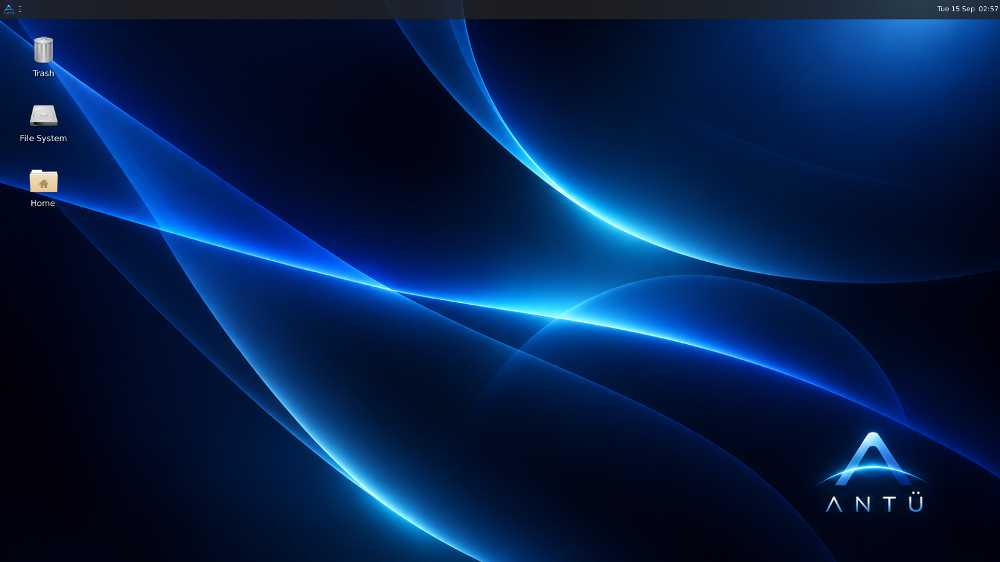
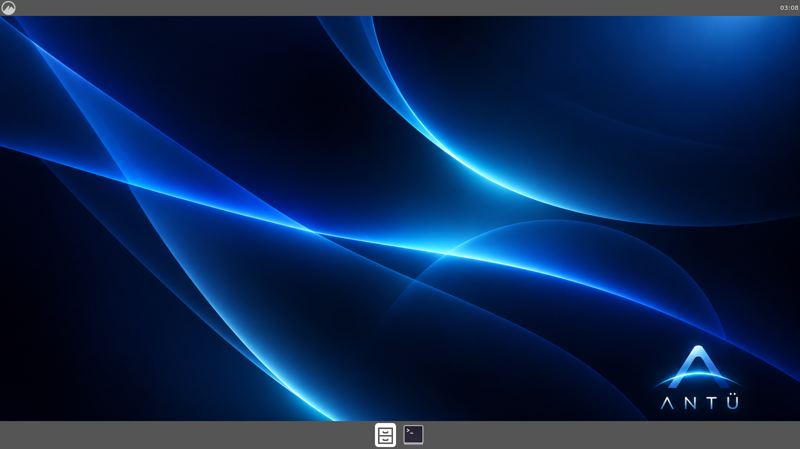

# Arquitectura de Antü OS

## Idea general

Antü OS **no** es un kernel ni un sistema operativo escrito desde cero.
Es una **distribución Linux personalizada** (un "respin" de Debian/Ubuntu)
que:

1. Usa el **kernel Linux** y la base de Debian/Ubuntu tal cual, para heredar
   soporte de hardware, drivers, seguridad y actualizaciones.
2. Reemplaza la capa de **escritorio y experiencia de usuario** por un
   diseño propio: familiar y fácil de usar para cualquiera que venga de
   Windows o mac, pero sin copiar a ninguno de los dos (ver sección
   "Shell de escritorio" más abajo).
3. Se empaqueta como **imagen ISO booteable e instalable** usando
   [`live-build`](https://manpages.debian.org/testing/live-build/lb.1.en.html),
   la herramienta oficial de Debian para construir distribuciones live/
   instalables.

Este enfoque es el que usan distribuciones reales y exitosas con el mismo
objetivo (dar a Linux una cara familiar para usuarios de Windows), como
Zorin OS o Linuxfx/Windowsfx. Nos permite tener algo **robusto y usable en
semanas**, en vez de años, sin sacrificar la posibilidad de personalizar
todo el sistema.

## Por qué no un kernel/OS desde cero

Escribir un sistema operativo completo desde cero (kernel, drivers,
scheduler, stack de red, sistema de archivos, entorno gráfico) es un
proyecto de investigación de varios años-persona, y aun así no llegaría a
tener la compatibilidad de hardware ni la robustez de Linux, que ya tiene
más de 30 años de desarrollo. Por eso la estrategia de este proyecto es
**construir sobre Linux**, no competir con él.

## Componentes por capa

| Capa | Tecnología | Notas |
|---|---|---|
| Kernel | Linux (kernel de Debian/Ubuntu) | Sin modificaciones en Legacy/Standard. En Pro se puede usar un kernel más nuevo (`linux-image-*-generic` o `liquorix`) para mejor soporte de hardware reciente. |
| Init / servicios | systemd | Estándar de Debian/Ubuntu. |
| Gestor de paquetes | APT / dpkg | Mismo ecosistema que Debian/Ubuntu, sin cambios. |
| Entorno gráfico base | X11 (Wayland opcional en Pro) | Depende de la edición. |
| Escritorio | XFCE (Legacy) / Cinnamon (Standard) / KDE Plasma (Pro) | Elegidos por consumo de recursos vs. features. |
| Shell / identidad | Barra superior única propia de Antü, wallpaper, logo | Configurada por edición en `editions/*/config/includes.chroot/`, assets en `shared/branding/`. Ver sección "Shell de escritorio". |
| Build system | `live-build` | Config declarativa en `editions/*/config/`. |

## Las tres ediciones

### Antü Legacy (`editions/antu-legacy`)

- Público: PCs con hardware equivalente a la era de Windows XP (Pentium 4 /
  Core 2 Duo, 512MB–2GB RAM, sin aceleración 3D confiable).
- Escritorio: **XFCE**, con compositor desactivado por defecto. Shell:
  barra superior única (ver "Shell de escritorio"), sin dock ni animaciones.
- Arquitectura: `i386` (32 bits). `live-build` solo permite una arquitectura
  por configuración, y `i386` corre tanto en hardware de 32 como de 64 bits,
  a diferencia de `amd64` (que no arranca en máquinas puramente de 32 bits) —
  por eso es la opción que da máxima compatibilidad con hardware viejo.
- Prioridad: arrancar rápido y consumir poca RAM, no efectos visuales.

### Antü Standard (`editions/antu-standard`)

- Público: uso doméstico/oficina, hardware equivalente a Windows 7 en
  adelante (Core i3+, 4GB+ RAM).
- Escritorio: **Cinnamon**. Shell: barra superior única (ver "Shell de
  escritorio"); el dock separado y más applets quedan para una siguiente
  etapa (ver `docs/ROADMAP.md`).
- Arquitectura: `amd64`.
- Prioridad: balance entre estética moderna y bajo consumo de recursos.

### Antü Pro (`editions/antu-pro`)

- Público: hardware potente (multinúcleo, GPU dedicada, SSD, 16GB+ RAM).
- Escritorio: **KDE Plasma**, con todos los efectos de composición
  habilitados, soporte Wayland, y ajustes de kernel/scheduler orientados a
  aprovechar múltiples núcleos y GPU.
- Arquitectura: `amd64` (con perfiles opcionales para `arm64` a futuro).
- Prioridad: máximo aprovechamiento del hardware disponible, sin resignar
  robustez.

## Shell de escritorio

Antü no copia ni a Windows ni a mac: toma la idea de una **barra global
única** (como mac, en vez de la barra de tareas de Windows) porque es un
patrón de interacción probado y fácil de aprender, pero la usa a su manera
y con la identidad visual propia (el arco de luz del logo, la paleta azul
profunda).

**Base común a las 3 ediciones** (implementada):

- Una barra fija arriba de la pantalla, con:
  - Lanzador de aplicaciones a la izquierda, con el logo de Antü.
  - Bandeja del sistema y reloj a la derecha.
- Un **dock** fijo abajo (Standard y Pro; Legacy no lo tiene, ver más
  abajo) con las apps fijadas y abiertas — ahí vive el cambio de ventana,
  no en la barra de arriba.
- Wallpaper de Antü como fondo por defecto.

En **Legacy** no hay dock separado (para no gastar recursos en un panel
extra): la lista de ventanas abiertas queda directamente en la barra de
arriba, como única barra.

Esto está configurado de fábrica en cada edición usando el mecanismo nativo
de cada entorno de escritorio (no es un tema visual superficial, son los
archivos de configuración reales que lee cada DE al iniciar sesión):

| Edición | Mecanismo | Archivos |
|---|---|---|
| Legacy (XFCE) | `xfconf` vía `/etc/skel` | `editions/antu-legacy/config/includes.chroot/etc/skel/.config/xfce4/xfconf/xfce-perchannel-xml/` |
| Standard (Cinnamon) | Defaults de `dconf` | `editions/antu-standard/config/includes.chroot/etc/dconf/db/local.d/00-antu-desktop` |
| Pro (KDE Plasma) | Paquete "Look and Feel" propio (`org.antu.desktop`) | `editions/antu-pro/config/includes.chroot/usr/share/plasma/look-and-feel/org.antu.desktop/` |

### Legacy: probado con una sesión XFCE real, no solo a mano

A diferencia del resto (validado solo por sintaxis), **Antü Legacy se
probó levantando una sesión XFCE real** (`xfce4-session`, con `xfwm4` +
`xfdesktop` + `xfce4-panel`) contra una pantalla virtual (`Xvfb`). Esto
encontró y corrigió dos bugs reales que ningún chequeo de sintaxis iba a
detectar:

1. **El wallpaper no se aplicaba.** `xfce4-desktop` nombra la propiedad
   del fondo según el monitor que detecta en cada máquina (`monitor0`,
   `monitorVGA-1`, `monitorHDMI-1`... varía según el hardware/driver de
   video). El XML estático que se había escrito a mano adivinaba un
   nombre que no coincidía con el real, así que el wallpaper de Antü
   nunca se veía — quedaba el de Debian/Xubuntu por defecto.
2. **XFCE tiene 4 escritorios virtuales**, cada uno con wallpaper propio.
   Aplicar el cambio solo al primero no alcanzaba: al abrir sesión en
   otro escritorio, volvía a aparecer el fondo por defecto.

La solución: en vez de adivinar nombres en un XML estático, un script
(`usr/local/bin/antu-set-wallpaper`, disparado por un autostart en
`etc/xdg/autostart/antu-wallpaper.desktop`) le pregunta a `xfconf` qué
monitores y escritorios existen de verdad al iniciar sesión, y aplica el
wallpaper de Antü a todas las combinaciones — y fuerza el redibujado con
`xfdesktop --reload`, porque tampoco se actualiza solo.

Con este fix, una sesión completamente nueva (sin ningún ajuste manual)
ya muestra el wallpaper y el logo de Antü correctamente:



**Tercer bug, encontrado en una revisión externa (Codex) y ya
corregido**: el script no distinguía "primer inicio de sesión" de
"inicios siguientes" — corría en todos, así que si el usuario elegía
otro wallpaper a mano, en el próximo inicio de sesión `antu-set-wallpaper`
se lo volvía a pisar con el de Antü, sin que hubiera forma de dejarlo
cambiado. Se corrigió con un archivo centinela
(`~/.config/antu/.wallpaper-set-once`): el script aplica el wallpaper de
Antü una única vez por usuario y después no vuelve a tocar la
configuración. Probado de punta a punta contra una sesión XFCE real:
primer inicio → aplica Antü; el usuario cambia el fondo a mano; segundo
inicio (simulado) → el cambio del usuario se mantiene intacto.
Limitación conocida y aceptada: un monitor agregado después de ese
primer inicio no recibe el wallpaper de Antü automáticamente (se
prioriza no romper una personalización ya hecha).

**Cuarto bug, de una revisión externa posterior (Codex)**: esa primera
corrección creaba el centinela **siempre**, incluso si XFCE tardaba más
que los 20 intentos de medio segundo esperando o si las escrituras a
`xfconf` fallaban — en ese caso no se aplicaba ningún wallpaper, pero el
script igual marcaba "ya hecho" y no lo volvía a intentar nunca más.
Justo el escenario más probable en el hardware lento al que apunta
Legacy. Se corrigió para que el centinela solo se cree después de
releer y confirmar que al menos una propiedad quedó con el valor de
Antü — no simplemente después de haber corrido los comandos. Probado
con los dos casos reales: con `xfdesktop` corriendo (aplica y marca) y
sin `xfdesktop` corriendo, simulando el timeout (no aplica nada y **no**
marca, para reintentar en el siguiente inicio de sesión).

**Dos arreglos menores más de la primera revisión**: `/etc/lsb-release`
se generaba copiando `/etc/os-release` tal cual, pero son formatos de
claves distintos (`DISTRIB_*` contra `NAME=`/`VERSION=`/`ID=`) — la
copia no generaba ninguna clave real, y algún programa viejo que solo
mira `lsb-release` quedaba sin poder identificar el sistema. Se corrigió
escribiendo el archivo con sus claves propias. Y la documentación decía
"compositor desactivado por defecto" en Legacy sin que existiera ningún
archivo que lo aplicara de verdad — se agregó
`xfwm4.xml`(`use_compositing=false`) para que la afirmación sea cierta.

### Standard: también probado con una sesión Cinnamon real

Le fue igual de bien que a Legacy. Se levantó `cinnamon` de verdad (no
`cinnamon-session` completo, que en este entorno de desarrollo específico
no llegaba a arrancar el shell por limitaciones del propio contenedor —
ver nota abajo) contra `Xvfb`, con nuestros defaults de `dconf` ya
aplicados. Resultado: **el mecanismo central funciona tal cual se
diseñó**, sin necesitar ningún fix como el de Legacy (Cinnamon guarda el
wallpaper en una clave de `gsettings` simple, sin nombres de monitor que
adivinar):



Se ve la barra superior (menú a la izquierda, reloj a la derecha) y el
dock abajo (`grouped-window-list`), ambos cargando los applets que
configuramos, con el wallpaper y el logo de Antü de fondo. Quedó
confirmado también un pendiente que ya estaba anotado: el ícono del
lanzador sigue siendo el genérico de Cinnamon, no el logo de Antü —
cambiarlo requiere tocar una configuración específica de esa instancia
del applet, más delicada que una propiedad global, y se dejó pendiente a
propósito (ver `docs/ROADMAP.md`).

*Nota sobre cómo se probó:* en este entorno de desarrollo puntual, correr
`cinnamon-session` completo (el gestor de sesión real) no llegaba a
mostrar el shell — dos causas, ninguna relacionada con la configuración
de Antü: el `python3` por defecto de este contenedor en particular no
coincidía con la versión para la que estaban compiladas las bindings de
`gi` (un contenedor de desarrollo normal, o la máquina de un usuario
final, no tiene este conflicto), y Cinnamon necesitaba variables de
entorno de sesión (`XDG_SESSION_TYPE`) que `cinnamon-session` no llegaba
a exportar antes de fallar. Arrancar `cinnamon` directamente, ya con esas
dos cosas resueltas a mano, funcionó de punta a punta.

## Español como idioma por defecto

Antü busca despegarse de Linux/Windows también en el idioma: en vez de
dejar el sistema en inglés (lo habitual en la mayoría de las distros),
**español (Argentina) es el idioma por defecto** de las 3 ediciones,
configurado vía `hooks/normal/0300-locale-es.hook.chroot` (genera y activa el
locale `es_AR.UTF-8` durante el build).

Esto traduce automáticamente casi todos los menús, categorías y textos
genéricos del sistema, porque tira de la traducción que la gran mayoría
de las aplicaciones de escritorio ya traen incluida — no hace falta
tocar cada aplicación a mano. Los nombres propios de las apps (Firefox,
LibreOffice, VLC) no se traducen, son marcas.

Se validó con una sesión XFCE real (`xfce4-appfinder`) que los nombres y
categorías de las aplicaciones efectivamente aparecen en español
("Accesibilidad", "Archivos", "Aplicaciones predeterminadas", etc.). La
cobertura de los textos propios de cada herramienta (botones, títulos de
ventana) depende de qué tan completa sea la traducción que traiga cada
paquete empaquetado — variará de programa a programa, y conviene
reconfirmarlo en Debian real (esto se probó en un entorno de desarrollo
basado en Ubuntu, que maneja los paquetes de idioma de forma distinta a
Debian).

### El hook alcanza para el sistema instalado, no para la sesión live

Encontrado en una revisión externa (Codex), confirmado contra el código
fuente oficial de `live-config` de Debian bookworm (`11.0.3+nmu1`): el
hook `0300-locale-es` deja `es_AR.UTF-8` como idioma del sistema **ya
instalado en disco**, pero la primera sesión que arranca directo desde
la ISO (antes de instalar nada) no la arma ese sistema de archivos — la
arma `live-config`, en cada arranque, a partir de los parámetros que
recibe el kernel al bootear. Su componente `0050-locales` usa
`en_US.UTF-8` por defecto si no se le indica nada por ese lado, y
**sobrescribe** `/etc/default/locale` — sin importar lo que haya quedado
configurado durante el build. Es un caso puntual de algo más general:
todo lo que dependa de qué arma `live-config` en el primer arranque no
se resuelve solo con hooks de build, porque `live-config` no mira lo que
hay en el filesystem, mira los parámetros de arranque.

Se corrigió agregando `--bootappend-live "locales=es_AR.UTF-8
keyboard-layouts=latam"` a `lb config` en las 3 ediciones (`auto/config`)
— el parámetro de arranque que `live-config` sí respeta. De paso se fijó
también el teclado (`latam`, el layout de Argentina), ya que el locale
por sí solo no determina la distribución de teclado. No se pudo probar
arrancando una ISO real en este entorno (Windows, sin acceso a
`live-build`/QEMU con la imagen construida) — queda pendiente confirmar
con `locale`, `/etc/default/locale` y `/proc/cmdline` en un arranque
real antes de dar el idioma de la sesión live por resuelto del todo.

## Íconos propios

Antü tiene su **propio tema de íconos** (`Antu`) en vez de reusar el
genérico de Linux, con el mismo lenguaje visual del logo: skeuomórfico,
en vidrio/metal azul con acentos cian y el "arco de luz" cruzando cada
pieza. Las fuentes originales (renders de alta resolución, 1254×1254,
con transparencia real) viven en `shared/branding/icons/png/`; a partir
de ahí se generó el tema instalable en
`shared/branding/icons/antu-icons/` siguiendo el estándar freedesktop
(hicolor), en 3 tamaños (256×256, 48×48 y 24×24 — se revisaron los tres
a mano para confirmar que se siguen leyendo bien en el tamaño chico de
panel/lista, no solo a full size):

| Ícono | Nombre freedesktop | Contexto |
|---|---|---|
| Papelera vacía | `user-trash` | Places |
| Papelera llena | `user-trash-full` | Places |
| Carpeta (genérica) | `folder` | Places |
| Carpeta (variante) | `folder-open` | Places |
| Descargas | `folder-download` | Places |
| Equipo | `computer` | Devices |
| Red | `network-workgroup` | Devices |
| Bienvenida a Antü | `start-here` | Applications |

La papelera usa el mecanismo nativo del estándar freedesktop
(`user-trash` / `user-trash-full`): el gestor de archivos elige sola cuál
mostrar según si la papelera tiene contenido, sin ninguna lógica
adicional de nuestra parte — es un cambio de nombre de archivo, no de
comportamiento. Las carpetas no tienen un estado "vacía/llena" nativo en
el estándar (a diferencia de la papelera); se usa `folder` como ícono
genérico por defecto (la variante con hojas asomando, que es la más
"Antü"), dejando `folder-open` disponible como alternativa.

El tema se instala en cada edición vía
`shared/scripts/install-branding.sh` (copia
`shared/branding/icons/antu-icons/` a
`includes.chroot/usr/share/icons/Antu/`) y se fija como tema por
defecto en la configuración de cada escritorio: `xsettings.xml`
(`Net/IconThemeName`) en XFCE/Legacy, `icon-theme` en
`org/cinnamon/desktop/interface` vía dconf en Cinnamon/Standard, y
`[Icons] Theme=Antu` en `kdeglobals` en Plasma/Pro.

Queda para una próxima sesión: cubrir el resto de los íconos de sistema
(configuración, terminal, etc.) con el mismo lenguaje visual — por ahora
esos quedan con la base genérica del tema heredado (`hicolor`) hasta ir
reemplazándolos de a poco.

### Pro: todavía sin sesión real

La pieza de Plasma sigue el formato y la API de scripting documentados de
KDE, pero **no se pudo probar en una sesión gráfica real** — KWin (el
compositor de Plasma) tiene requisitos más pesados que XFCE y Cinnamon, y
no se llegó a levantar en el tiempo disponible. Queda pendiente la misma
validación que ya le hizo bien a Legacy y Standard (ver
`docs/ROADMAP.md`).

### Lanzador de Antü (Standard)

En vez de un menú de carpetas, Antü Standard abre con **Super+Espacio** un
buscador de aplicaciones (`rofi`, con un tema propio en
`shared/branding/` → `editions/antu-standard/config/includes.chroot/usr/share/rofi/themes/antu.rasi`):
escribís y filtra al toque, sin scrollear menús.

A diferencia del resto del shell, esta pieza **sí se pudo probar
visualmente de verdad**: se armó una pantalla virtual (`Xvfb`) en el
entorno de desarrollo, se abrió el lanzador contra esa pantalla y se sacó
una captura real en cada iteración. Eso hizo aparecer varios bugs reales,
ya corregidos:

- El nombre técnico del modo ("drun") se colaba pegado al texto de
  búsqueda.
- Sin especificar una fuente, el tema usaba la tipografía monoespaciada
  por defecto de rofi (daba un aire a terminal/DOS de los 90) — ahora usa
  **Inter** (`fonts-inter`, agregado a `package-lists`).
- La primera versión se veía plana/rudimentaria. Se le agregó
  profundidad real: un degradé de fondo (más claro arriba, más oscuro
  abajo) y el ítem seleccionado con su propio degradé tipo "botón con
  relieve" — una referencia directa a cómo Windows viene resolviendo esto
  desde siempre, para que se sienta familiar.
- Al armar el degradé aparecieron 2 límites reales de esta versión de
  rofi (1.7.5), no evidentes sin probar: `linear-gradient()` no acepta
  variables `@nombre` como color (hay que poner el hex literal), y
  `border-color` no admite un color distinto por lado (no se pudo hacer
  el bisel de dos tonos que se había probado primero). También un
  separador visual se infló y ocupó toda la ventana por faltarle
  `expand: false` — quedó como una línea fina de 1px.
- El texto del ítem seleccionado (celeste claro) quedaba en blanco y no
  se leía — el color de texto que se le pone a `element` no lo hereda el
  sub-widget `element-text`, que es el que en realidad dibuja el texto
  (y el fragmento resaltado por la búsqueda). Hubo que fijarlo ahí
  también, explícitamente.


*(El fondo negro liso de la captura es una limitación del banco de
pruebas — una pantalla X vacía sin el escritorio corriendo detrás — no
del diseño: en el sistema real se ve el wallpaper de Antü, que se
configura por otro lado y ya está validado — ver la sección de Cinnamon
más arriba.)*

Todavía falta: que el logo de la barra superior abra este lanzador (hoy
abre el menú nativo de Cinnamon; el atajo de teclado sí es de Antü). El
buscador ya hereda el tema de íconos propio (`Antu`) para las carpetas
del sistema; los íconos por app individual dependen de que cada paquete
tenga su propio ícono en el tema activo, algo fuera del alcance de
`antu-icons`.

**Lo que falta, y que se piensa agregar de forma incremental por edición**
(de más simple a más compleja, ver `docs/ROADMAP.md`):

- El indicador de "app abierta" en el dock usando el arco de luz del logo
  en vez del puntito genérico de cada DE — requiere un tema visual propio
  (CSS/Qt), todavía no existe.
- Que el logo de la barra abra el lanzador de Antü (por ahora solo el
  atajo de teclado lo hace).
- El lanzador con buscador en Legacy y Pro (por ahora solo en Standard).
- Un panel de **ajustes rápidos** (red, volumen, brillo) desplegable desde
  la derecha de la barra.
- Efectos visuales (blur, animaciones) en las ediciones con más recursos
  (Pro primero, después Standard). Legacy se mantiene siempre simple.

## Compatibilidad: veniendo de Windows

Objetivo explícito: alguien que usaba Windows tiene que poder migrar a
Antü sin sentir que perdió funcionalidad. Esto no es un tema visual —
son paquetes y configuración concreta, en las 3 ediciones
(`package-lists/compat.list.chroot` y `hardware.list.chroot`).

### Dos aclaraciones importantes (para no vender humo)

- **No existe una app de escritorio de Claude para Linux** (Anthropic
  solo publica binarios para Mac/Windows). El camino real y sin parches
  es usar **claude.ai desde el navegador** — misma cuenta, mismo
  historial, funciona perfecto. Se puede armar un acceso directo que lo
  abra "como app" (misma técnica que "Instalar como aplicación" de
  Chrome/Edge), pero eso es un acceso directo al sitio, no una app
  nativa instalada.
- **Microsoft Office tampoco existe para Linux.** El equivalente real es
  **LibreOffice** (ya instalado en Standard y Pro): abre y guarda
  `.docx`/`.xlsx`/`.pptx` de forma nativa. Para que un documento hecho en
  Word no se vea "corrido" al abrirlo acá, hace falta además que las
  fuentes que usó (Arial, Calibri, Times New Roman, Cambria) tengan un
  reemplazo con el mismo ancho de letra — ver más abajo.

### Pendrives y discos externos (montaje automático)

`udisks2` + `gvfs`/`gvfs-backends` + `policykit-1` son la base por la
que XFCE (Thunar), Cinnamon (Nemo) y Plasma (Dolphin) detectan un
dispositivo nuevo y lo montan solos, sin que el usuario configure nada.
A eso se le suma soporte de lectura/escritura para los 3 formatos que un
pendrive o disco externo puede traer si se usó antes en Windows:

- **NTFS** → `ntfs-3g` (controlador en espacio de usuario vía FUSE).
- **exFAT** (típico en pendrives y tarjetas SD modernas) → `exfatprogs`
  + el driver `exfat` del kernel de Linux (incluido de fábrica en el
  kernel que trae Debian).
- **FAT32** → `dosfstools` + el driver `vfat` del kernel.

**Validado de verdad, no solo instalado**: se armaron 3 imágenes de
disco de prueba (formateadas FAT32, exFAT y NTFS con las mismas
herramientas que se instalan acá) y se probó montarlas como si fueran un
pendrive recién enchufado. El montaje NTFS vía `ntfs-3g` (que no
depende de un módulo del kernel, corre entero en espacio de usuario) se
probó de punta a punta: montar, escribir un archivo, leerlo, desmontar —
funcionó igual que en un sistema real. El montaje de FAT32/exFAT no se
pudo completar en este entorno de desarrollo porque el kernel del
sandbox donde se corre este proyecto no trae compilados los módulos
`vfat`/`exfat` (es un contenedor recortado, no una instalación real de
Debian) — **no es una limitación de la configuración de Antü**: el
kernel que trae Debian de fábrica sí incluye esos módulos, y es el mismo
mecanismo (`mount -t vfat`/`mount -t exfat`) que ya se confirmó
funcionando para NTFS. Queda para validar en una máquina/VM real, igual
que Plasma (ver más abajo).

### Apps que no vienen empaquetadas para Debian

Para que "quiero instalar tal programa" no dependa de que ese programa
tenga paquete `.deb`, las 3 ediciones traen:

- **Flatpak**, con el repositorio de **Flathub** ya agregado de fábrica
  (`hooks/normal/0400-flatpak-flathub.hook.chroot`) — miles de apps modernas se
  empaquetan ahí. Standard suma **GNOME Software** y Pro **Discover**
  (la tienda nativa de Plasma) con el backend de Flatpak, para instalar
  con una interfaz gráfica tipo "tienda de apps". Legacy se queda solo
  con la línea de comandos (`flatpak install ...`), para no cargar
  hardware de la era XP con una tienda gráfica pesada.
- **Soporte de AppImage** (`libfuse2`): un `.AppImage` descargado
  funciona con solo marcarlo ejecutable y hacerle doble clic, como un
  `.exe` portable en Windows — no necesita instalación.

### Ofimática: que un documento de Word no se vea roto

Además de LibreOffice, las 3 ediciones instalan fuentes **métricamente
compatibles** con las de Office: `fonts-liberation2` (sustituto de
Arial/Times New Roman/Courier New) y `fonts-crosextra-carlito`/
`fonts-crosextra-caladea` (sustitutos de Calibri/Cambria, las fuentes
por defecto de Word/Excel desde 2007). "Métricamente compatible" quiere
decir que cada letra ocupa el mismo ancho que la original: un documento
hecho en Word con esas fuentes mantiene los saltos de línea y de página
al abrirlo acá, aunque la tipografía use un dibujo distinto (no son
copias pixel a pixel de las fuentes de Microsoft, que son privativas).

### Hardware: wifi, bluetooth e impresoras

`hardware.list.chroot` (existía solo en Pro; ahora está en las 3, con
Legacy usando un set más liviano) agrega:

- Firmware no libre de los chipsets de wifi/bluetooth más comunes
  (`firmware-realtek`, `firmware-iwlwifi`, `firmware-atheros`,
  `firmware-brcm80211`) — la causa más común de "no me detecta el wifi"
  en una instalación de Linux nueva.
- `bluez` + `blueman` para emparejar mouse/teclado/auriculares
  inalámbricos desde una interfaz gráfica.
- `cups` + drivers de impresora (`printer-driver-all` en Standard/Pro;
  un set más chico de Gutenprint/HP en Legacy) + `avahi-daemon`, que
  detecta impresoras de red/AirPrint solas, sin cargar una IP a mano.

No se pudo probar contra hardware real (wifi/bluetooth/impresora físicos
no existen en este entorno de desarrollo) — igual que Plasma, queda
pendiente de validar en una máquina real.

## Fusión funcional: correr programas de Windows (Wine)

Todo lo de la sección anterior es compatibilidad de *archivos y
protocolos*. Esto es distinto: que un `.exe` de Windows **corra**
directo en Antü, con doble clic, como en Windows. Es la pieza más
"WinLux" del proyecto — no un Linux con estética de Windows, sino un
sistema que de verdad ejecuta software de los dos mundos.

### Cómo funciona (no es una VM ni un emulador)

Wine no simula un procesador (eso sería un emulador, mucho más lento)
ni corre una copia de Windows de fondo (eso sería una máquina virtual,
necesita licencia y el doble de RAM/disco). Wine es una **capa de
compatibilidad**: cuando un `.exe` le pide algo al sistema operativo
(abrir una ventana, escribir un archivo), Wine traduce ese pedido en
tiempo real al equivalente de Linux. El programa corre directo sobre el
procesador real, a velocidad casi nativa, sin Windows instalado en
ningún lado.

**Validado de verdad en este entorno de desarrollo** (no solo se
instaló el paquete, se probó el motor funcionando):

1. Se instaló `wine64` y se levantó una pantalla virtual (`Xvfb`).
2. Se corrió `wine notepad.exe` — el Bloc de notas de Windows (una
   reimplementación de Wine, no el binario real de Microsoft, pero usa
   el mismo motor de ventanas/eventos que cualquier `.exe` real) abrió
   su ventana ("Untitled - Notepad") contra la pantalla virtual. Se
   confirmó con una captura real, igual que se hizo con XFCE/Cinnamon.
3. Se probó el puente de archivos: se escribió un archivo desde el lado
   Windows (`wine cmd /c "echo ... > C:\...\Desktop\prueba.txt"`) y se
   leyó ese mismo archivo desde el lado Linux (`cat`) — confirma que
   "Documentos"/"Escritorio" de una app de Windows corriendo en Wine
   apunta a las carpetas reales del usuario, no a una copia aislada.

### Qué se instala

- **Legacy** (ya es i386): `wine` (resuelve solo a `wine32`, no hace
  falta nada extra), `wine-binfmt`, `winetricks`.
- **Standard/Pro** (amd64): acá la mayoría del software de Windows viejo
  es de **32 bits**, y por defecto amd64 con Wine solo trae soporte de
  64 bits. Para el de 32 bits hace falta la arquitectura i386 como
  arquitectura secundaria, habilitada **antes** de instalar cualquier
  paquete (si se hiciera después, ya sería tarde: apt habría resuelto
  las dependencias sin saber que i386 iba a existir). **No hace falta
  ningún hook para esto** — es un mecanismo propio de `live-build`, no
  algo que haya que orquestar a mano: cuando una entrada de un
  package-list tiene el formato `paquete:arquitectura` (acá,
  `wine32:i386`), `live-build` la detecta (`Discover_package_architectures`
  en `functions/packagelists.sh`), guarda las arquitecturas distintas a
  la principal, y antes de instalar nada corre `dpkg --add-architecture`
  dentro del chroot y actualiza `apt` (`chroot_install-packages`).
  Confirmado leyendo el código fuente oficial de `live-build` de Debian
  bookworm (`1:20230502`) y trixie (`1:20250505+deb13u1`) — la misma
  revisión externa que antes había señalado, con razón, que un hook
  `.chroot_early` que este proyecto tuvo para esto no existía en esas
  versiones. No hacía falta: `wine32:i386` en el package-list alcanza
  por sí solo. Con eso, se agrega `wine64` + `wine32:i386` +
  `wine-binfmt` + `winetricks` (que automatiza instalar las dependencias
  que piden muchos instaladores de Windows: .NET, Visual C++
  Redistributable, componentes de DirectX).
  `hooks/normal/0070-verify-wine32.hook.chroot` confirma, después de
  instalar los paquetes, que i386 quedó habilitada y `wine32:i386`
  terminó instalado de verdad — no alcanza con confiar en el mecanismo,
  hay que comprobar que corrió bien.

### La parte "mágica": doble clic en un `.exe`

Que Wine esté instalado no alcanza — si el usuario tiene que abrir una
terminal y escribir `wine programa.exe`, no es una fusión, es una
opción para expertos. Antü asocia los tipos de archivo de Windows de
fábrica (`includes.chroot/usr/share/applications/`) con el **Antü
Resolver** (ver más abajo), no con Wine directamente:

- `antu-wine-exe.desktop` ("Abrir con Antü") → `antu-resolver run %f`.
- `antu-wine-msi.desktop` ("Instalar con Antü") → `antu-resolver
  install %f` (`.msi` es el formato de instalador estándar de Windows).
- `mimeapps.list` los declara como aplicación **por defecto** para
  `application/x-ms-dos-executable`, `application/x-msdownload` (los
  dos nombres que usa el estándar freedesktop para "ejecutable de
  Windows") y `application/x-msi`.

Que el nombre visible sea "Abrir con Antü" y no "Abrir con Wine" es
deliberado: al usuario no le tiene que importar qué corre por debajo,
solo que la app abre.

**Validado de verdad**: se armó un archivo con el encabezado real de un
ejecutable de Windows (los bytes `MZ` con los que arranca todo `.exe`),
y se confirmó con las mismas herramientas que usa cualquier gestor de
archivos (Nemo/Thunar/Dolphin comparten este mecanismo, es del
estándar freedesktop, no algo de una sola app):

```
$ xdg-mime query filetype prueba.exe
application/x-msdownload
$ xdg-mime query default application/x-msdownload
antu-wine-exe.desktop
```

Es decir: el sistema reconoce el `.exe` por su contenido real (no por
la extensión del nombre) y ya sabe que se abre con Antü — sin que el
usuario toque nada. Como los archivos de `includes.chroot` se copian
directo al sistema de archivos (no pasan por `apt`), no disparan solos
el aviso que actualiza la caché de aplicaciones; por eso
`hooks/normal/0500-wine-desktop-db.hook.chroot` corre `update-desktop-database`
explícitamente después de copiarlos.

### Antü Resolver: el cerebro que decide cómo abrir cada archivo

Idea sugerida por Sofi (la colaboradora de ChatGPT de Juan en este
proyecto) en un documento de propuesta: que el usuario nunca tenga que
preguntarse "¿esto es de Windows o de Linux?" — un único componente
central decide cómo ejecutar o instalar cada cosa. No hace falta que
sea "inteligencia artificial": alcanza con una tabla de motores
conocidos más una caché de qué le funcionó a cada app, el mismo
mecanismo que usan por dentro Lutris o Bottles para juegos.

`shared/resolver/antu-resolver` es una primera versión real de esto, no
solo la idea (instalado como `/usr/bin/antu-resolver` en las 3
ediciones). Recibe un archivo y decide:

- `.exe`/`.msi` (detectado por contenido real, no por extensión) →
  Wine.
- `.AppImage` → se le da permiso de ejecución y se corre directo.
- `.deb` → se instala con `apt`/`gdebi`.
- `.flatpakref` → se instala con `flatpak install`.

Cada vez que abre un `.exe`/`.msi` por primera vez, guarda el resultado
en `~/.local/share/antu/resolver-profiles.json` (motor usado, estado,
cuándo) usando **nombre de archivo + tamaño en bytes** como identificador
de la app — no solo el nombre. Corregido tras una revisión externa
(Codex): usar solo el nombre hacía que dos instaladores distintos con el
mismo nombre típico (dos `setup.exe` de programas totalmente distintos)
compartieran el mismo resultado de compatibilidad, algo peor que no
tener caché. El tamaño no es una identidad perfecta, pero es información
gratis y baja mucho la chance de choque real. Limitación que persiste:
si el mismo instalador se descarga de nuevo con otro nombre de archivo,
el Resolver no lo reconoce y arranca de cero con él.

**Tres bugs reales encontrados en una revisión externa (Codex) y
corregidos, cada uno confirmado con una prueba, no solo releyendo el
código**:

1. **El estado quedaba pegado en "éxito" después de un fallo tardío.**
   La versión anterior marcaba `status: ok` si el proceso seguía vivo a
   los 3 segundos, pero nunca volvía a actualizarlo — si la app se
   caía recién a los 5 minutos, la caché seguía diciendo que todo
   estaba bien. Se corrigió con un modelo de 3 estados en vez de un
   veredicto binario: `failed` (se cayó de entrada), `started` (sigue
   vivo, no implica que sea utilizable) y `exited` (terminó, con el
   código de salida real guardado como dato — sin reinterpretarlo como
   "falló", porque muchas apps de Windows devuelven códigos distintos
   de 0 al cerrarse normal bajo Wine). Probado con un doble de proceso
   controlado (vivo al chequeo inicial, sale con código 7 más tarde):
   la caché terminó en `exited`/`exit_code: 7`, no pegada en `ok`.
2. **Condición de carrera en la caché.** Dos lanzamientos al mismo
   tiempo leían el archivo, cada uno escribía su cambio por separado, y
   el segundo en escribir podía borrar la actualización del primero.
   Se corrigió con un lock exclusivo (`fcntl.flock`) sobre todo el
   ciclo leer-modificar-escribir, tomado solo por los milisegundos que
   dura esa operación (nunca mientras la app queda abierta, para no
   bloquear otros lanzamientos). Probado con 50 hilos actualizando la
   caché al mismo tiempo: las 50 entradas sobrevivieron.
3. **Rutas relativas mal pasadas a `apt`.** `antu-resolver install
   paquete.deb` pasaba la ruta tal cual a `apt-get install` vía
   `pkexec` — si `pkexec` (o cualquier paso intermedio) corre con un
   directorio de trabajo distinto, esa ruta relativa deja de apuntar al
   archivo correcto. Se corrigió normalizando a ruta absoluta al
   principio de `resolve()`, antes de despachar a cualquier motor
   (cubre también AppImage y Wine, no solo `.deb`).

También se blindó la lectura de la caché contra un archivo corrupto con
JSON válido pero de forma equivocada (por ejemplo `[]` en vez de un
objeto, o una entrada puntual como `{"app.exe:0": [1]}`), que antes
rompía con `AttributeError` al primer uso.

**Un hueco en esa misma protección, de una tercera revisión externa
(Codex)**: la validación cubría la *lectura* (`run_wine` descartaba una
entrada que no fuera un diccionario al consultarla) pero no la
*escritura*. `update_cache_entry` vuelve a leer la caché fresca dentro
de su transacción (a propósito, para no pisar cambios de otro proceso —
ver más arriba), y ese segundo lugar hacía `cache.get(key, {})` sobre el
valor viejo sin validar su tipo: con una entrada como `{"app:0": [1]}`,
intentar `{**[1], ...}` rompía con `TypeError: 'list' object is not a
mapping`. Se corrigió validando también ahí. Probado con los 4 casos que
pidió la revisión (entrada lista, `null`, cadena, y una sana de
control): las tres corruptas quedan reparadas como diccionarios válidos
después de `run_wine`, sin romper, y la entrada sana no se toca.

**Validado de verdad, con un cuidado importante que apareció al
probarlo por primera vez**: la versión original del chequeo de 3
segundos se probó de punta a punta contra una pantalla virtual: el
Bloc de notas de Windows (un `.exe` real, extraído de la propia
instalación de Wine, no un mock) se abrió a través del Resolver, la
ventana apareció, y el archivo de caché quedó escrito correctamente
antes incluso de que la ventana terminara de aparecer.

### El bug más tonto: arreglar el código no alcanza si no llega a la ISO

Una **segunda revisión externa** (Codex, sobre el commit que ya tenía
todo lo de arriba corregido) encontró algo vergonzoso: los 3 bugs del
Resolver de la sección anterior sí estaban arreglados en
`shared/resolver/antu-resolver`, pero **las 3 ediciones seguían
empaquetando la copia vieja** en
`includes.chroot/usr/bin/antu-resolver` — un archivo separado, versionado
aparte, que nadie había vuelto a copiar después de corregir el original.
Confirmado con hashes: el archivo compartido y las 3 copias empaquetadas
tenían contenido distinto. Cualquier ISO compilada hasta ese commit
habría instalado el Resolver con los bugs ya "corregidos" en el papel.

La causa de fondo no era solo "olvidarse de copiar" — es que la
copia manual es un proceso que se puede volver a olvidar. La solución
no fue copiar una vez más a mano, sino sacarle la posibilidad de
desincronizarse: las copias por edición **dejaron de versionarse**
(agregadas a `.gitignore`) y ahora `scripts/build.sh` las genera en cada
build directo desde la única fuente real, igual que ya se hacía con el
branding. Ver `docs/BUILD.md`.

Ojo con esto al revisar el resto del proyecto: cualquier otro archivo
que se haya copiado "a mano" alguna vez a `includes.chroot/` de las 3
ediciones tiene el mismo riesgo si su origen se vuelve a tocar.

### Red mixta con PCs Windows (Samba)

Wine resuelve "correr un programa de Windows". Esto resuelve otra parte
de la fusión: que Antü y una PC con Windows en la misma red doméstica u
oficina se vean y compartan archivos entre sí, sin instalar nada
aparte ni tocar una consola — el ícono "Red" (Fase 0.5) apuntando a algo
real. Se arma con `samba` (el servidor SMB, el mismo protocolo que usa
Windows para "Compartir carpeta") + `smbclient` + `cifs-utils` (para que
Antü también pueda montar carpetas compartidas por una PC Windows) +
`wsdd`, que anuncia a Antü en la red al estilo moderno de Windows 10/11
(WS-Discovery) — el viejo NetBIOS que dependía de un "explorador
maestro" en la red es cada vez menos confiable, así que sin `wsdd` una
PC con Windows nuevo puede directamente no ver a Antü en su lista de
Red.

Antü trae de fábrica una carpeta compartida (`/srv/antu-compartido`,
visible como `\\antu-hostname\Compartido` desde Windows), pero **con
acceso por cuenta, no de invitado**. La primera versión de esto usaba
`guest ok = yes` con permisos `0777` — se corrigió tras una revisión
externa (Codex) que señaló dos problemas reales, confirmados después
contra la documentación de Microsoft y con una prueba real (ver abajo):

1. **Windows 10/11 actualizado restringe el acceso de invitado por
   política** desde hace varios años — un share de invitado puede
   directamente no dejar conectarse desde una PC Windows moderna, sin
   que el usuario entienda por qué, a menos que reactive esa política a
   mano (algo que no tiene sentido pedirle).
2. Escritura anónima con permisos `0777` significa que cualquiera con
   acceso a esa red —no solo el usuario de la PC— puede modificar el
   contenido compartido.

Ahora la carpeta pertenece a un grupo (`antu-compartido`) y Samba pide
usuario/contraseña. Como con la contraseña de Samba pasa lo mismo que
con `[homes]` (es propia, separada de la de Linux, y no se puede crear
en el momento de compilar la ISO porque el usuario todavía no existe),
se agregó `antu-compartir-configurar`: un comando (`sudo
antu-compartir-configurar`) que en un solo paso suma al usuario al
grupo y le pide configurar esa contraseña.

**Validado de verdad, protocolo real, en los dos sentidos**: se armó la
configuración (`etc/samba/smb.conf`), se corrió `smbd` (sin `systemd`,
igual que se hizo con `udisks2` en la sección de compatibilidad), y se
probaron ambos caminos con `smbclient`:

```
$ smbclient //localhost/Compartido -N -c "ls"          # invitado
tree connect failed: NT_STATUS_ACCESS_DENIED

$ smbclient //localhost/Compartido -U usuario%clave -c "put prueba.txt prueba.txt"
putting file prueba.txt as \prueba.txt (2.9 kb/s)       # cuenta real: funciona
```

El acceso de invitado queda rechazado de verdad (no solo en la
configuración escrita), y una cuenta con la contraseña de Samba
configurada sube/baja archivos sin problema — el mismo camino que
recorrería un archivo copiado desde el Explorador de Windows.

**Segundo hallazgo, de una revisión externa posterior (Codex)**: que dos
cuentas puedan *conectarse* no significa que puedan *colaborar*. Sin
nada más, un archivo creado por el usuario A queda con el grupo
**primario** de A (no necesariamente `antu-compartido`) — las máscaras
de permisos (`create mask`/`directory mask`) limitan qué tan abiertos
son los permisos, pero no deciden de qué grupo termina siendo dueño el
archivo. El usuario B, aunque también pertenezca a `antu-compartido`,
podía terminar sin permiso real para modificar lo que creó A. Se agregó
`force group = antu-compartido`, que fuerza ese grupo en todo lo que se
crea en la carpeta sin importar quién lo haga.

**Validado con dos cuentas reales, no una inferencia sobre el papel**:
se crearon dos usuarios de prueba con grupos primarios distintos
(`antu-user-a`, `antu-user-b`), A creó una carpeta y un archivo por SMB,
y B pudo *sobrescribir* ese archivo y crear uno nuevo dentro de la
carpeta de A sin ningún error de permisos — con ambos archivos quedando
del grupo `antu-compartido` en el filesystem real, sin importar quién
los creó. Se reconfirmó también que el invitado sigue rechazado con
este cambio.

### Honestidad sobre los límites

Wine reimplementa a mano miles de funciones de la API de Windows —no es
magia perfecta—. Funciona muy bien para utilidades, software de oficina
viejo, muchos juegos no muy exigentes. Puede fallar con: protecciones
anti-piratería agresivas, drivers en modo kernel, hardware con dongle
USB propietario. No hay forma de saber de antemano si un `.exe`
puntual va a andar sin probarlo — es la naturaleza de reimplementar una
API ajena, no un defecto de esta integración. [WineHQ AppDB](https://appdb.winehq.org)
es la referencia de la comunidad para consultar compatibilidad conocida
de programas puntuales antes de instalarlos.

### Lo que queda para más adelante

- **Bottles**: una interfaz gráfica sobre Wine (crea un "prefijo"
  aislado por app, con su propio instalador visual) mucho más amigable
  que usar Wine pelado. Se distribuye como Flatpak — como Flathub ya
  está configurado (ver sección de compatibilidad más arriba), instalarlo
  va a ser un clic desde la tienda de apps, no hace falta bakearlo en la
  ISO. No se intentó automatizar su instalación *durante* el build
  porque necesitaría acceso a internet real a Flathub en el momento de
  compilar, algo que no se puede probar en este entorno (mismo motivo
  por el que no se compiló una ISO completa todavía). Una vez instalado,
  no hace falta que Antü haga nada especial para que aparezca como
  alternativa al abrir un `.exe`: las apps de Flatpak exportan sus
  propios `.desktop` con `MimeType`, así que Bottles va a listarse solo
  en el "Abrir con..." del gestor de archivos, al lado de "Abrir con
  Antü" (el Resolver) — es el mecanismo estándar de asociación de
  archivos, el mismo que usa el Resolver, no algo que haya que integrar
  a mano. No se pudo instalar Bottles de verdad en este entorno para
  confirmarlo en la práctica (sin acceso a Flathub), así que queda
  como "razonablemente seguro por cómo funciona el estándar", no como
  "validado".
- **Proton/Steam** para juegos (ver `docs/ROADMAP.md`), pensado
  principalmente para Antü Pro.
- Una **"Antü Store" propia** que unifique apt + Flatpak + AppImage +
  instaladores de Wine en una sola interfaz — la pieza más ambiciosa de
  toda la fusión, ver `docs/ROADMAP.md`. `antu-resolver` ya sabe
  distinguir `.deb`/`.flatpakref` además de `.exe`/`.msi`; falta la
  interfaz gráfica que lo use como backend.
- **ANTU Home** (idea de Sofi): que "Documentos"/"Descargas"/etc. sean
  conceptualmente las mismas carpetas para cualquier app, sin importar
  si corre nativa o por Wine. **Ya es así hoy** para todo lo que corre
  por Wine — es un comportamiento nativo de cómo Wine mapea
  `C:\Users\...\Documents` a la carpeta real de Linux (confirmado en la
  sección anterior con la prueba de escritura/lectura cruzada), no algo
  que haya que construir. Si en algún momento se suma una VM (ver
  "Windows Core" más abajo), ahí sí habría que replicarlo con
  `virtiofs` (carpetas compartidas de QEMU).
- **ANTU Device Bridge** (idea de Sofi): compartir dispositivos
  (portapapeles, impresora, audio) entre apps nativas y de Windows.
  Para todo lo que corre por Wine, **tampoco hace falta construirlo**:
  el portapapeles ya es compartido con el resto del escritorio (Wine
  usa el portapapeles de X11 directo), y la impresión ya sale por CUPS
  igual que cualquier app Linux. Donde sí habría trabajo real es si se
  suma una VM: ahí cada dispositivo (USB, webcam, GPU) necesita su
  propio mecanismo de passthrough en QEMU, caso por caso.
- **ANTU Windows Core** (idea de Sofi): para el software que ni Wine ni
  Proton logren correr, una máquina virtual de Windows tan integrada
  que se sienta invisible (sin ver el escritorio de Windows, solo la
  ventana de la app). Es una idea real y con antecedentes (es lo que
  hacen VMware Fusion/Parallels con su "modo Unity/Coherence" en Mac) —
  pero con dos límites que no son de ingeniería, sino de fondo:
  - **Necesita que el usuario aporte su propia licencia e ISO de
    Windows.** Ninguna distro puede empaquetar o regalar Windows por
    dentro sin pagarle una licencia a Microsoft por cada instalación;
    esto no se resuelve con más código. Antü podría, como mucho,
    automatizar la creación de esa VM *a partir de* una licencia que el
    usuario ya tiene, nunca proveerla.
  - **Mostrar *solo* la ventana de la app** (no el escritorio
    completo), con aceleración de GPU, es un problema de ingeniería
    serio: la técnica más conocida para esto (FreeRDP RemoteApp)
    necesita que el lado Windows sea Windows Server/RDS, algo que
    Windows 10/11 Home o Pro normal no ofrecen de fábrica. Y la GPU
    acelerada dentro de una VM en general necesita **dos placas de
    video** (una para el equipo anfitrión, otra dedicada a la VM) —
    la mayoría del hardware con una sola GPU no lo puede aprovechar
    del todo. Mostrar la VM completa en una ventana normal (sin el
    modo "invisible") sí es simple y anda desde el día uno con
    `virt-manager`/`virtual-machine-viewer`; la parte "invisible" queda
    como objetivo de largo plazo, no como algo prometido.
- **ANTU Link** (idea de Sofi): una app complementaria para Windows que
  sincronice carpetas/preferencias, para que alguien que hoy usa
  Windows y después prueba Antü encuentre sus archivos de entrada. En
  vez de programar un sincronizador desde cero, tiene más sentido armarlo
  sobre **Syncthing** (software libre, multiplataforma, ya maduro) y
  ponerle la cara de Antü encima — ahorra meses de bugs de sincronización
  ya resueltos por otros.
- **Perfiles de compatibilidad comunitarios** (idea de Sofi): antes de
  construir una base de datos propia (que necesita una comunidad de
  usuarios que hoy no existe), tiene más sentido que `antu-resolver`
  consulte más adelante bases ya existentes y probadas como [WineHQ
  AppDB](https://appdb.winehq.org) o [ProtonDB](https://www.protondb.com)
  antes de "adivinar" con una app nueva.

## Flujo de build

```
editions/<edicion>/auto/     →  lb config (genera/actualiza editions/<edicion>/config/)
editions/<edicion>/config/   →  package-lists/, hooks/, includes.chroot/ (nuestro) + metadata de live-build
                              →  lb build
                              →  editions/<edicion>/build/*.iso
```

`auto/` y `config/` tienen que ser hermanos (ambos hijos directos de
`editions/<edicion>/`) — ver `docs/BUILD.md`, sección "Estructura de la
configuración de `live-build`", para el porqué exacto (un error real de
este proyecto, ya corregido, tenía `auto/` anidado adentro de `config/`,
lo que hacía que `live-build` nunca encontrara nuestros
package-lists/hooks/includes.chroot).

Ver [`BUILD.md`](BUILD.md) para el detalle paso a paso.
